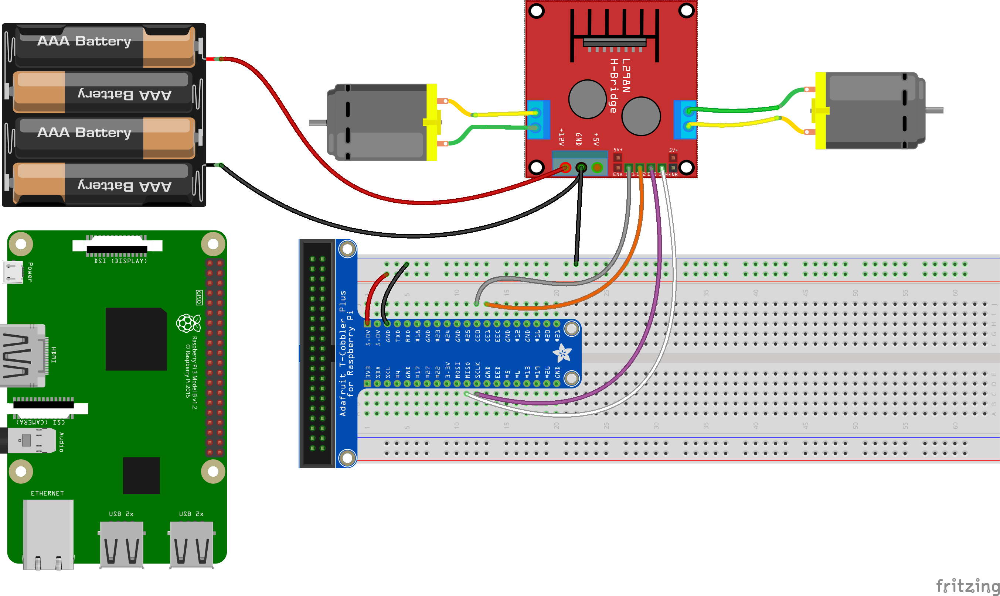

# Curso Raspberry Pi

## BiblioMaker de la Facultad de Ciencias

Diciembre 2019

## José Antonio Vacas  @javacasm

## http://bit.ly/RaspiBM

# Motores

Necesitamos:
* Driver: L298 o L293 o similar
* Alimentación externa
* Motores

